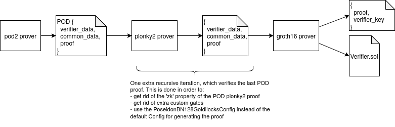

# pod2-onchain

## Usage
- Run: `bash full-flow.sh`
  - alternatively:
    - `cargo run --release`
    - `go run main.go`

## Acknowledgements
This repo relies on the following projects:
- Plonky2: https://github.com/0xPolygonZero/plonky2
- Pod2: https://github.com/0xPARC/pod2
- Gnark plonky2 verifier: https://github.com/succinctlabs/gnark-plonky2-verifier
